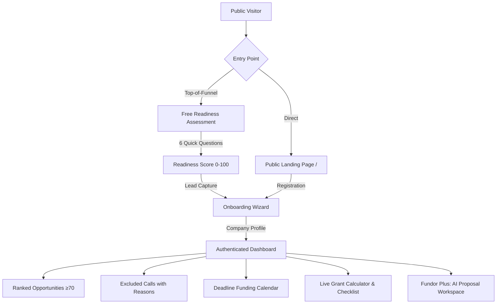

<div align="center">

# Fundor.hu

Frontend integration: [API setup and examples](docs/FRONTEND-API.md) · [OpenAPI contract](openapi.yaml)

### AI-Powered Grant & Funding Intelligence for Hungarian SMEs

> *"Ne te keresd a pályázatot. A Fundor megtalálja neked."*  
> *(Don't go looking for grants. Fundor finds them for you.)*

[](https://php.net)
[](https://laravel.com)
[](#license--intellectual-property-protection)
[](#bilingual-architecture-hu--en)
[](#core-algorithms--scoring-engine)

</div>

---

## Executive Summary

Hungarian small and medium-sized enterprises (SMEs) have access to substantial non-repayable EU and national grants (typically 5–50 million HUF per successful tender). However, most companies never apply due to three systemic market barriers:

1. **Volume Without Relevance:** Public portals list hundreds of complex tenders without personalized filtering.
2. **Impenetrable Eligibility Criteria:** Rules combine staff headcount bands, TEÁOR activity codes, regional NUTS-2 restrictions, closed financial years, project size floors, own-contribution minimums, and de minimis state aid ceilings.
3. **Invisible Deadlines:** Evaluation stages often exhaust budgetary envelopes weeks before formal closing dates.

**Fundor is not another passive grant list.** It is an automated, personalized decision-making layer that deterministically filters open calls against a structured company profile, synthesizes a 5-factor relevance score (0–100), and provides itemized legal justifications for every recommendation.

---

## Visual Architecture & Pipeline

```
  ┌─────────────────────────────────────────────────────────────┐
  │                 SME Company Funding Profile                 │
  │   (Headcount, TEÁOR Code, Region, Investment, De Minimis)   │
  └──────────────────────────────┬──────────────────────────────┘
                                 │
                                 ▼
  ┌─────────────────────────────────────────────────────────────┐
  │           Deterministic Eligibility Filter (Hard Rules)     │
  │     Operators: between | in | not_in | >= | <= | ==         │
  └──────────────────────────────┬──────────────────────────────┘
                                 │
         ┌───────────────────────┼───────────────────────┐
         ▼                       ▼                       ▼
   [NOT_ELIGIBLE]       [INSUFFICIENT_DATA]        [ELIGIBLE /
   Hard rule failed     Missing value queried      CONDITIONAL]
   (e.g. Pest excluded) (e.g. de minimis audit)         │
         │                       │                      │
         ▼                       ▼                      │
   Excluded from           Interactive Ask              │
   Score calculation       & Profile Update             │
                                 │                      │
                                 └──────────────────────┤
                                                        ▼
  ┌─────────────────────────────────────────────────────────────┐
  │             5-Factor Weighted Relevance Engine              │
  │     Score = 35% Eligibility + 25% ProjectFit +              │
  │             15% FundingSize + 15% Timing + 10% Feasibility  │
  └──────────────────────────────┬──────────────────────────────┘
                                 │
                                 ▼
  ┌─────────────────────────────────────────────────────────────┐
  │                    Fundor Intelligence UI                   │
  │   Ranked Opportunities • "Miért ajánljuk?" • Grant Calc     │
  └─────────────────────────────────────────────────────────────┘
```



---

## Design System & Color Tokens

The landing page and application share Tailwind v4 tokens in `resources/js/index.css`.
Landing styles in `src/components/landing/landing.css` use the same brand palette.

| Token | Hex | Role |
|---|---|---|
| `--color-brand-orange` | `#FE7743` | Primary actions and brand accents |
| `--color-brand-slate` | `#273F4F` | Dark panels and secondary actions |
| `--color-brand-ink` | `#161616` | Primary text, footer and Fundor Plus surfaces |
| `--color-brand-cream` | `#EFEEEA` | Warm backgrounds and text on dark surfaces |
| `--color-brand-paper` | `#FAFAF9` | Application background |
| `--color-brand-green` | `#4F8F5E` | Eligible status |
| `--color-brand-amber` | `#C9762E` | Conditional status |
| `--color-brand-red` | `#C1443D` | Not eligible status |
| `--color-brand-muted-2` | `#939FA7` | Insufficient data status |

Existing semantic tokens such as `--color-gold`, `--color-ink` and `--color-paper` alias the
brand tokens, keeping application screens aligned with the landing page. Typography uses
**Plus Jakarta Sans** for body and display text and **Space Mono** for monospace text.

---

## Core Algorithms & Scoring Engine

### 1. Deterministic Eligibility Engine
The core product rule: **the engine filters, the AI explains — the AI can never override a deterministic eligibility verdict.**

The rule engine assesses declarative criteria (`{field, operator, value}`) and emits one of four unambiguous verdicts:

| Verdict | Semantic Color | Meaning |
|---|---|---|
| `ELIGIBLE` | Green (`#4F8F5E`) | All hard criteria pass. Project size, region, TEÁOR code, and business history match. |
| `CONDITIONAL` | Amber (`#C9762E`) | Core criteria pass, but external conditions apply (e.g. de minimis certificate, co-financing proof). |
| `INSUFFICIENT_DATA` | Slate (`#939FA7`) | Required information is unknown. The system questions the user rather than guessing. |
| `NOT_ELIGIBLE` | Red (`#C1443D`) | At least one hard gate fails. The call is immediately ruled out with specific legal grounds. |

### 2. Five-Factor Relevance Formula

$$\text{Fundor Score} = 0.35 \times \text{Eligibility} + 0.25 \times \text{ProjectFit} + 0.15 \times \text{FundingSize} + 0.15 \times \text{Timing} + 0.10 \times \text{Feasibility}$$

| Factor | Weight | Basis of Calculation |
|---|---|---|
| **Eligibility** | **35%** | Proportion of mandatory hard criteria fulfilled. |
| **ProjectFit** | **25%** | Semantic overlap between company development goals and call objectives. |
| **FundingSize** | **15%** | Proportion of planned budget absorbed within the call's funding floor and ceiling. |
| **Timing** | **15%** | Calendar days remaining until submission stage closure. |
| **Feasibility** | **10%** | Administrative complexity, required document count, and own-contribution ratio. |

**Score Bands:**
- **85–100:** Highly Recommended (Primary pursuit)
- **70–84:** Relevant Opportunity (Secondary pursuit, surfaced on dashboard by default)
- **50–69:** Conditional Opportunity (Requires specific prerequisite resolution)
- **0–49:** Low Relevance (Filtered out by default)

---

## Landing Page

The public `/` route composes its sections in `resources/js/pages/landing/LandingPage.tsx`,
with components and styles in `src/components/landing/` and Hungarian/English copy in
`src/data/landingContent.ts`.

- Hero with a locally validated tax-number entry and an illustrative funding preview.
- Feature tabs, catalogue statistics, entrepreneur banner, value proposition and quick actions.
- Use cases, an editorial journey, case-study carousel, Free/Fundor Plus plans, animated FAQ and footer.
- Sticky navigation with section scrolling, mobile menu and language selection.
- GSAP/ScrollTrigger animations for reveals, counters and progress bars; Lenis smooth scrolling.
  The scroll hook and section reveals respect reduced-motion preferences and clean up on unmount.

Preview scores and case studies are illustrative; catalogue counts are fetched from the API,
with loading, unavailable and retry states. Landing tax-number validation checks the local CDV
checksum without making a NAV request. Informational disclaimers remain visible in page content
and the footer. Signed-in users with a company profile go to their application home;
administrators go to the admin console.

---

## Bilingual Architecture (HU / EN)

The React interface defaults to Hungarian (`hu`) in both development and production.
The language toggle updates the Zustand UI store and i18next, persisting the choice in
local storage under `fundor-rewrite-ui`.

- Landing copy: `src/data/landingContent.ts`.
- Shared translations: `resources/js/i18n/locales/`.
- Feature translations: `resources/js/features/*/i18n/` and `resources/js/app/i18n/`.
- Language initialization and fallback: `resources/js/i18n/i18n.ts`.

---

## Directory Layout

The backend is a JSON API under `/api`; the user interface is the React app in `resources/js/`, built into `public/spa/`
and served by one Laravel route. There are no Blade pages.

```text
├── app/
│   ├── Http/
│   │   ├── Controllers/Api/                # One controller per area of the contract (openapi.yaml)
│   │   │   ├── AuthController.php          # Session cookie auth: register, login, logout, me
│   │   │   ├── CatalogController.php       # Catalog, search, opportunity detail, saved, eligibility answers
│   │   │   ├── ProfileController.php       # Company profile, versions, restore, reference data
│   │   │   ├── NavTaxpayerController.php   # Registration: company lookup by tax number
│   │   │   ├── LeadController.php          # Public lead capture from the free assessment
│   │   │   ├── AdminController.php         # Users, subscriptions, catalog refresh
│   │   │   ├── CrmController.php           # Pipeline, contacts, leads, notes, tasks
│   │   │   └── HealthController.php        # /api/health
│   │   ├── Middleware/FundorApi.php        # JSON-body rule and same-origin (CSRF) rule
│   │   └── Requests/ValidateTaxpayerRequest.php   # Tax number shape + check digit
│   ├── Services/
│   │   ├── Scoring.php                     # THE scorer: eligibility verdict + five-factor score + explanations
│   │   ├── Catalog.php                     # Scored catalog, teasers, locked detail (the paywall)
│   │   ├── {Accounts,Profiles,Crm,CatalogRefresh}.php
│   │   └── Sector/                         # TEÁOR → sector map, statutory revenue bands
│   └── Models/                             # CompanyProfile, Lead, Opportunity, User
├── config/fundor.php                       # Product settings (plans, EUR/HUF, feed URL, SPA index path)
├── database/                               # Migrations and the OpportunitySeeder (demo calls; creates no accounts)
├── resources/js/                           # React application, routes, shared components and design tokens
├── resources/static/                       # Static assets copied into public/spa
├── src/components/landing/                  # Landing sections, animation hooks and styles
├── src/data/landingContent.ts               # Hungarian and English landing copy
├── package.json                            # Frontend commands run from the repository root
├── openapi.yaml                            # The API contract — single source of truth
├── docs/FRONTEND-API.md                    # Setup notes and examples for the contract
├── routes/
│   ├── api.php                             # /api/...
│   └── web.php                             # One fallback route: every non-/api GET returns the built SPA
└── tests/
    ├── Feature/                            # API contract, paywall/scoring, NAV lookup, SPA fallback
    ├── Unit/                               # Scoring parity (golden), sector map, tax number, revenue bands
    └── Fixtures/scoring/                   # 48 real calls × 8 companies scored by the reviewed prototype engine
```

---

## Quick Start & Installation

### Prerequisites
- **PHP 8.2** or higher (with `pdo_sqlite`, `mbstring`, `openssl`, `tokenizer`, `xml` extensions)
- **Composer 2.x**
- **Node.js 22+** & **npm**

### Backend

```bash
git clone https://github.com/davidnagy-netizen/fundordothu.git
cd fundordothu

# the repository has no storage/ skeleton, so create it before installing
mkdir -p storage/framework/{cache/data,sessions,views} storage/logs storage/app/public bootstrap/cache

composer install
cp .env.example .env && php artisan key:generate
touch database/database.sqlite && php artisan migrate
php artisan db:seed --class=OpportunitySeeder     # demo calls. Do NOT run DatabaseSeeder on a shared database.
php artisan serve --host=127.0.0.1 --port=8000
```

### Frontend

```bash
# Run from the repository root
npm ci
npm run dev        # http://localhost:5173 with hot reload; proxies /api to 127.0.0.1:8000
# or
npm run build      # writes public/spa; then open http://127.0.0.1:8000 — Laravel serves it
```

`composer dev` (repo root) starts the API and the Vite dev server together. Without a build, non-API URLs answer
`503` with the command to run.

---

## Verification & Testing

Execute the automated test suite with PHPUnit:

```bash
# Run all feature and unit tests
php artisan test

# Test specific components
php artisan test --filter=ScoringParityTest
php artisan test --filter=SubscriberScoringTest

# Frontend checks (run from the repository root)
npm test
npm run typecheck
npm run lint

# Focused landing and language-toggle regression tests
npm test -- resources/js/pages/landing resources/js/components/LanguageToggle.test.tsx
```

---

## License & Intellectual Property Protection

This software, its source code, scoring algorithms, and user interface architecture are **PROPRIETARY AND CONFIDENTIAL** property of **Fundor.hu / Aetherpontis**. All rights reserved.

> **LEGAL NOTICE & STATUTORY WARNING:**  
> Strictly zero permission is granted to copy, clone, mirror, reproduce, modify, redistribute, sublicense, decompile, or reverse engineer this software, in whole or in part, without prior explicit written permission from the copyright holder.
>
> Any unauthorized copying, distribution, or replacement constitutes intentional copyright infringement under domestic and international intellectual property legislation (including EU Directive 2004/48/EC and WIPO conventions). Violators will be prosecuted to the maximum extent of the law, including civil claims for statutory and compensatory damages, injunctive relief, and criminal prosecution.

For complete terms and legal enforcement details, see the official **[LICENSE](LICENSE)** document.

For licensing permissions, enterprise agreements, or legal inquiries:
- Legal Department: `legal@fundor.hu` / `contact@aetherpontis.com`

---

## Disclaimers & Official Attributions

- **Data Sources:** Tenders and guidelines are processed from official government and European Union databases, including *palyazat.gov.hu* (Nemzeti Fejlesztési Központ), *kap.gov.hu* (Közös Agrárpolitika), *SEDIA* (EU Funding & Tenders Portal), and *Kohesio* (European Commission).
- **Regulatory Notice:** Fundor.hu is an algorithmic decision-support tool. It does not provide legal counsel or fiduciary financial advice. Award decisions rest exclusively with governing grant authorities.

<div align="center">
  <sub>Built with care for Hungarian SMEs by Aetherpontis.</sub>
</div>
